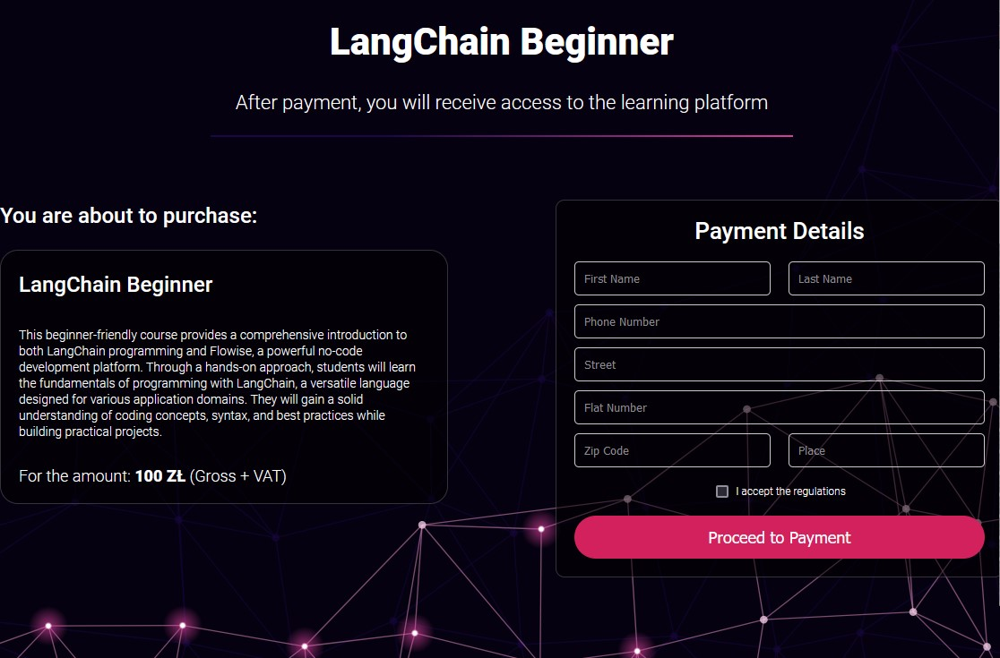

  <h3 align="center">LangChain-LearningPlatform - Get knowledge about modern AI technology!</h3>
  

    
    
    
    
     
  

**App is uploaded to free server. Server needs some time to start (about 30s or more). Loading screen is normal behavior.
The current application uses a sandbox mode and is a preview version of the
final application.**

## 📋 <a name="table">Table of Contents</a>

1. 📎 [Introduction](#introduction)
2. ⚙️ [Tech Stack](#tech-stack)
3. 💻 [First Look](#first-look)
4. 😎 [About Me](#about-me)

## <a name="introduction">📎 Introduction</a>

I am developing an innovative online learning platform that offers registered
users access to a wide range of courses. 
Through a variety of textual content,
videos, and interactive quizzes, our users can acquire knowledge tailored to
their preferences. 
My platform not only facilitates the purchase of intriguing
courses but also allows users to track their progress, engage with a community
of learners, and acquire skills necessary to accomplish personal and
professional goals.

## <a name="tech-stack">⚙️ Tech Stack</a>

- React
- Redux
- Express
- TypeScript
- MongoDB
- PayU
- css-modules

## <a name="first-look">💻 First Look</a>

✨ Welcome to LangChain!

## Register/Login

Register or log in to unlock the ability to purchase new courses, which will be
assigned to your account. Email verification is required upon registration.
Please check your email and click on the activation link to proceed.

## Check Current Offer

Check out our current course offerings. Select the course that interests you and
proceed to payment.

## Buy Course Using PayU

Purchase courses using PayU.

## Pick Course In User Dashboard

After purchasing a course, you can choose it in your dashboard. Your learning
progress is tracked and displayed in the course card as a summary.

## Learn From Platform

The course page provides the option to learn from text materials, video
recordings, and quizzes.

## Test your knowledge

As part of your course access, you have the opportunity to test your newly
acquired knowledge through interactive quizzes.

## <a name="about-me">😎 About Me</a>

Hello this app was created by me! Enjoy. If you have any question, feel free to
create new issue ticket. Otherwise you can contact me via my socials or email:

- 📱 <a href="https://www.linkedin.com/in/emil-szymczyk-209613209/">linkedin</a>
- 📧 email: emil-szymczyk2@wp.pl
